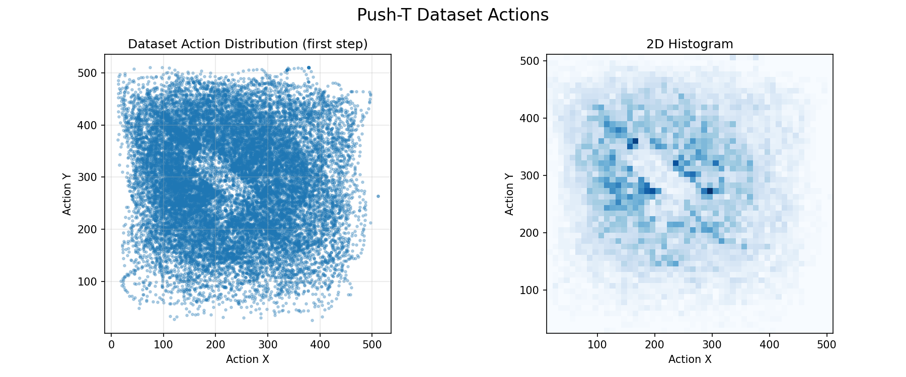
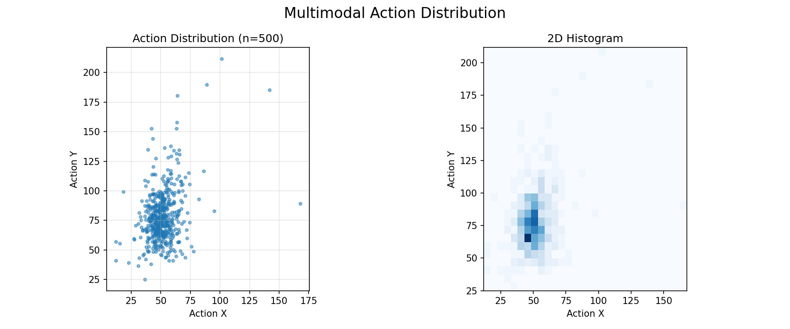
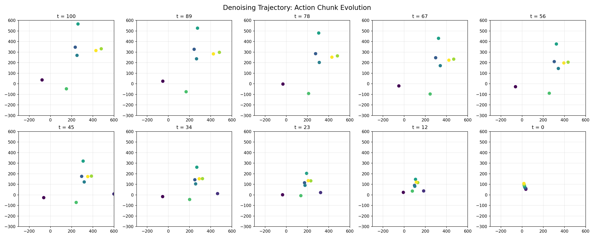
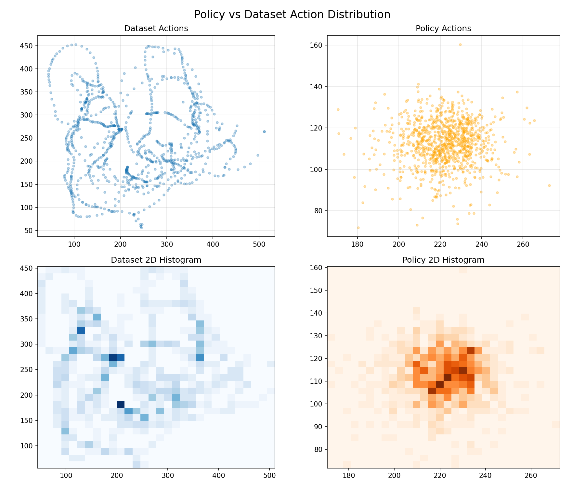

<div align="center">


# Diffusion Policy for Push-T

**State-based diffusion policy** for the Push-T task, built around a **Conditional U-Net 1D**, **FiLM conditioning**, **cosine noise schedule**, **EMA**, and **DDIM sampling**.

<p>
    <a href="#demo">Demo</a> ·
    <a href="#results">Results</a> ·
    <a href="#quick-start">Quick Start</a> ·
    <a href="#project-structure">Project Structure</a>
</p>

</div>

<p align="center">
    
</p>

---

## What This Does

This repository re-implements [Diffusion Policy](https://diffusion-policy.cs.columbia.edu/) for the Push-T benchmark: the model does not predict actions directly, but instead learns to denoise a noisy action horizon conditioned on recent observations. That makes it much better suited to multimodal behavior, where the same state may admit several valid actions.

### Core design

| Component | Implementation |
|---|---|
| Architecture | Conditional U-Net 1D with down dimensions `[256, 512, 1024]`, kernel size `5`, FiLM conditioning |
| Noise schedule | Cosine schedule via `diffusers.DDPMScheduler` |
| Conditioning | Global conditioning from the first `n_obs_steps` observations |
| Training target | Epsilon prediction with MSE loss |
| EMA | `inv_gamma=1.0`, `power=0.75` |
| Inference | DDIM sampling with 100 steps |
| Optimizer | AdamW, `lr=1e-4`, `betas=(0.95, 0.999)`, `weight_decay=1e-6` |

---

## Demo

<div align="center">

<video src="./videos/demo.mp4" controls width="60%"></video>

</div>

If your renderer does not display the embedded video, open [videos/demo.mp4](videos/demo.mp4) directly.

---

## Results

The repository already includes the main visual outputs under `plots/`:

<table>
    <tr>
        <td width="50%"></td>
        <td width="50%"></td>
    </tr>
    <tr>
        <td></td>
        <td></td>
    </tr>
</table>

- `dataset_actions.png` shows the expert action distribution.
- `action_distribution.png` shows the multimodal samples from the policy.
- `denoising_trajectory.png` shows how the action chunk evolves from noisy to clean.
- `policy_vs_dataset.png` compares generated actions with the dataset.

---

## Why Diffusion Policy

| Aspect | MSE Regression | Diffusion Policy |
|---|---|---|
| Model | Direct observation-to-action mapping | Noisy action plus observation -> predicted noise |
| Training | `MSE(pred_action, expert_action)` | `MSE(pred_noise, true_noise)` |
| Inference | Single forward pass | Iterative denoising |
| Multimodality | Tends to average modes | Preserves multiple valid modes |
| Action quality | Often smooth but generic | Often sharper and more realistic |

The important point is simple: MSE compresses uncertainty into one average action. Diffusion keeps the distribution alive and samples from it during inference.

---

## Quick Start

### 1. Install

```bash
pip install -r requirements.txt
```

### 2. Download the dataset

```bash
mkdir -p data/pusht
wget https://diffusion-policy.cs.columbia.edu/data/training/pusht.zip -O /tmp/pusht.zip
unzip /tmp/pusht.zip -d data/pusht/
```

### 3. Train

```bash
python train_ddpm.py --epochs 500 --batch_size 256 --device cuda --use_ema
```

For Colab or Drive-backed checkpoints:

```bash
python train_ddpm.py --epochs 500 --batch_size 256 --device cuda --use_ema \
    --ckpt_dir /content/drive/MyDrive/diffusion_policy_checkpoints
```

### 4. Evaluate

```bash
python evaluate.py --num_episodes 50 --device cuda --ckpt_path checkpoints/diffusion_policy.pt
```

### 5. Visualize

```bash
python visualize.py --device cuda --ckpt_path checkpoints/diffusion_policy.pt
```

---

## Colab Workflow

1. Open [diffusion_colab.ipynb](diffusion_colab.ipynb) in Colab.
2. Switch runtime type to GPU.
3. Run all cells.

The notebook mounts Drive, installs dependencies, downloads the dataset, trains the policy, and then evaluates and visualizes the checkpoint.

---

## Project Structure

```text
.
├── common/
│   ├── noise_schedule.py
│   ├── normalizer.py
│   └── replay_dataset.py
├── envs/
│   └── pusht_env.py
├── models/
│   ├── noise_pred_net.py
│   └── unet1d.py
├── checkpoints/
│   └── diffusion_policy.pt
├── data/
│   └── pusht/
├── plots/
│   ├── action_distribution.png
│   ├── dataset_actions.png
│   ├── denoising_trajectory.png
│   ├── policy_vs_dataset.png
│   └── pusht_preview.png
├── videos/
│   └── demo.mp4
├── diffusion_colab.ipynb
├── evaluate.py
├── infer_denoise.py
├── inspect_target.py
├── paths.py
├── record_video.py
├── train_ddpm.py
├── visualize.py
└── requirements.txt
```

---

## Notes

- The dataset lives at `data/pusht/pusht_cchi_v7_replay.zarr`.
- Horizon is `16`, observation horizon is `2`.
- Normalization is min-max scaling to `[-1, 1]` per dimension.
- `checkpoints/diffusion_policy.pt` is the default trained model included in the repo.

---

## References

- [Diffusion Policy](https://diffusion-policy.cs.columbia.edu/) — Chi, Feng, Du, Xu, Cousineau, Burchfiel, Song. RSS 2023.
- [Official repo](https://github.com/real-stanford/diffusion_policy) — real-stanford/diffusion_policy.
- [Denoising Diffusion Probabilistic Models](https://arxiv.org/abs/2006.11239) — Ho, Jain, Abbeel. NeurIPS 2020.
- [DDIM](https://arxiv.org/abs/2010.02502) — Song, Meng, Ermon. ICLR 2021.

<div align="center">

Made for Push-T diffusion policy experiments.

</div>